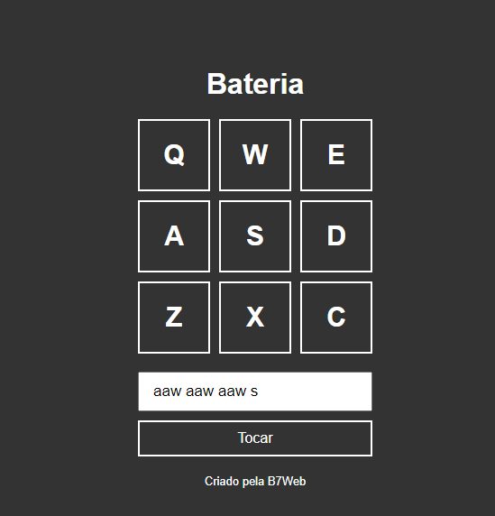

<h1 align="center"> Bateria </h1>

  <a href="#-tecnologias">Tecnologias</a>&nbsp;&nbsp;&nbsp;|&nbsp;&nbsp;&nbsp;
  <a href="#-projeto">Projeto</a>

 

  

## 💻 Tecnologias

Esse projeto foi desenvolvido com as seguintes tecnologias:

- HTML
- CSS
- Javascript
- Git e Github

## 💻 Projeto

Esse projeto é uma bateria 100% funcional.

Você pode tocar a bateria de duas maneiras:

1. Utilizando as teclas do seu teclado;
2. Digitando o ritmo desejado para compor sua música.

Divirta-se!
